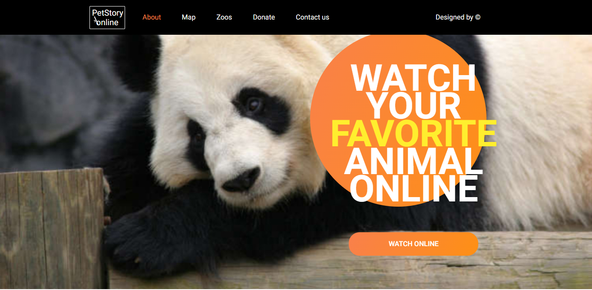

# Online-zoo
🔗 https://marerma-online-zoo.netlify.app/

Online-zoo - это платформа, где собрана информация о животных из различных зоопарков, имеющих веб-камеры. Предполагается, что пользователь может открыть страницу с ресурсами зоопарка, понаблюдать за кем-либо из животных или сделать пожертвование, на которое будет закуплен корм. В рамках задания, нам предстоит сделать адаптивную верстку и интерактивность главной страницы, и страницы с донатами.

**[Макет в figma](https://www.figma.com/file/ypzT9idgAILaSRVRmDAJxn/online-zoo-3-weeks)**  

## Функционал приложения

- Фиксированная верстка страниц `main` и `donate`.
- Адаптивная верстка страниц `main` и `donate` 1600px - 320px
- Бургер-меню в мобильной версии, слайдер-галерея животных, слайдер секции отзвов, popup-окно для просмотра полной версии отзывов при ширине экрана менее 640px
- Интерактивные элементы на странице `donate`: 💳 выбор суммы пожертвования, ввод суммы и автоматическое обновление слайдера

